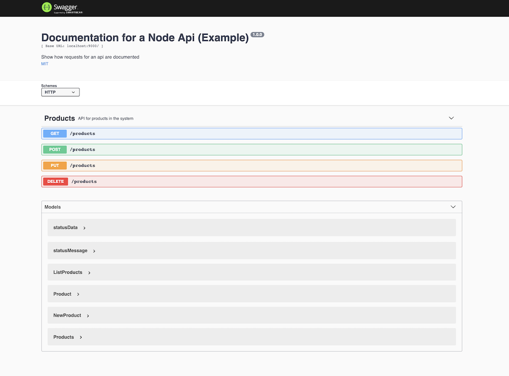

# node-swagger

Estructura de una API en NodeJS y documentación con Swagger.

## Instalación

- Clona este repositorio: git clone https://github.com/JaimeRC/node-swagger.git`
- Ìnicializa el proyecto: 
    - `cd node-swagger`
    - `npm install --save`
    - `npm start`
- Ve al navegador y muestra esta URL para ver la documentación: `http://localhost:9000/api-docs`

## Imagen de ejemplo
