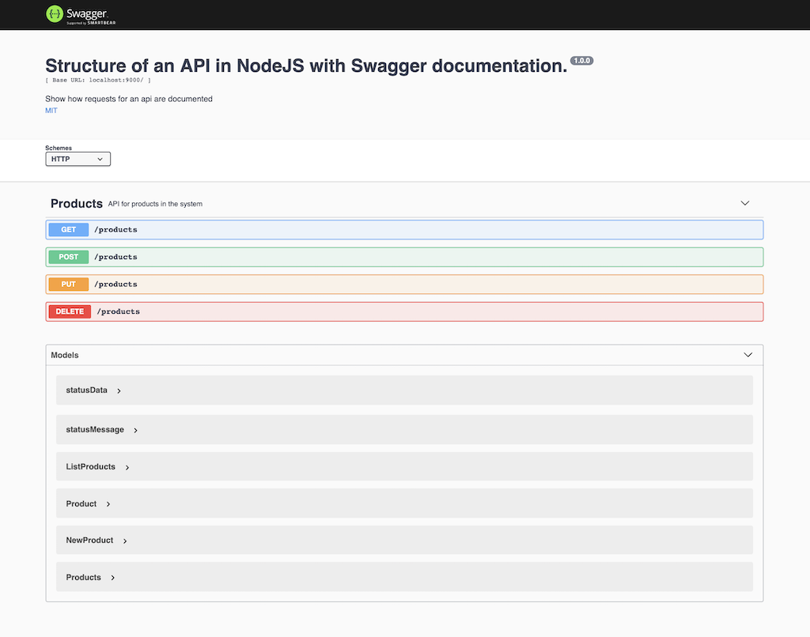
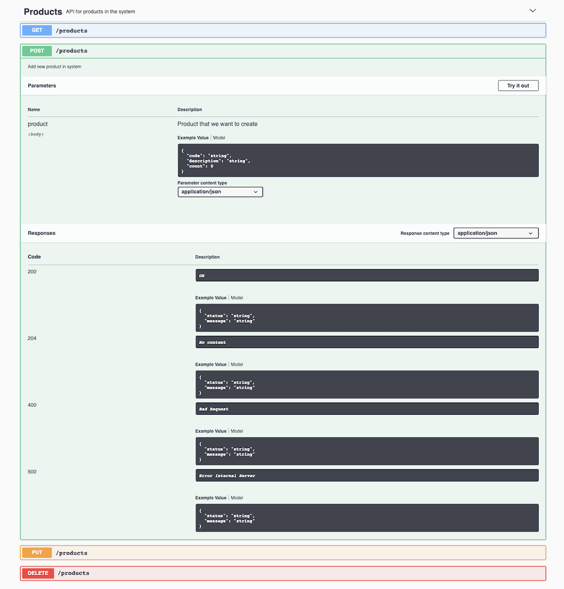
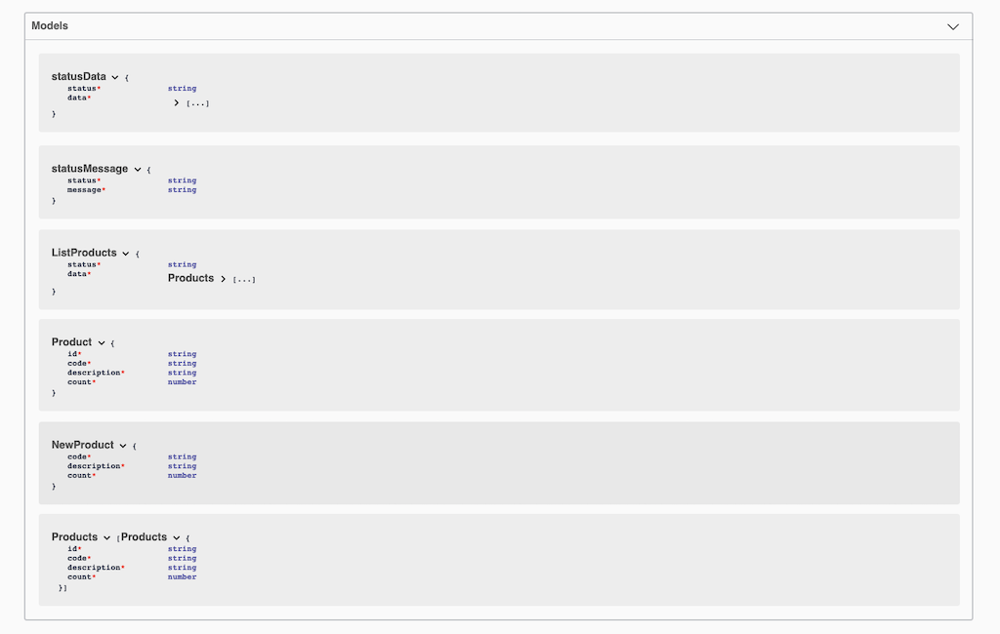

# node-swagger

Estructura de una API en NodeJS y documentación con Swagger.

## Estructura del Proyecto

    app.js                        # Archivo de inicializacion
      ├───api-docs                # Documentación e configuración de Swagger
      ├───config                  # Variable de entorno y constantes para el Proyecto
      ├───data                    # Datos para el proyecto y Readme
      ├───db                      # Conexión a las DBs
      ├───routes                  # Rutas  
      |     ├───controllers       # Controlladores para cada Ruta
      |     └───middleware        # Filtros y complementos para las Rutas
      ├───test                    # Archivos de Test
      └───utils                   # Scripts de utilidades para el proyecto

## Instalación

- Clona este repositorio: git clone https://github.com/JaimeRC/node-swagger.git`
- Ìnicializa el proyecto: 
    - `cd node-swagger`
    - `npm install --save`
    - `npm start`
- Ve al navegador y muestra esta URL para ver la documentación: `http://localhost:9000/api-docs`

## Imagenes

### Inicio

### Petición

### Modelos
